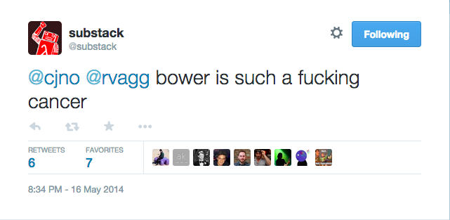
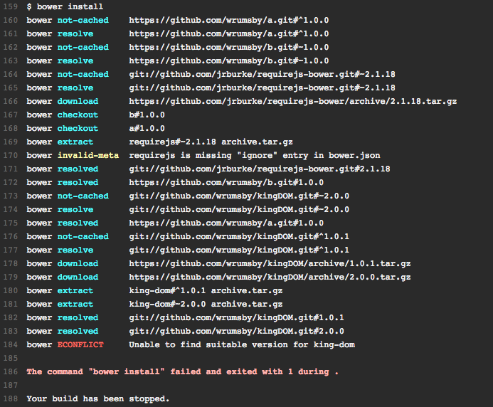
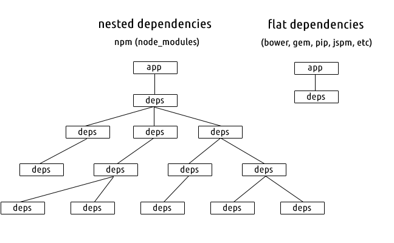
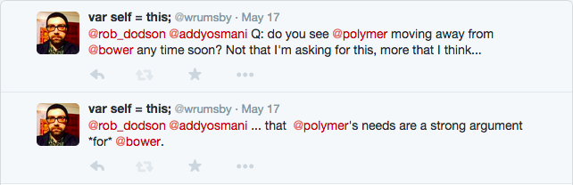
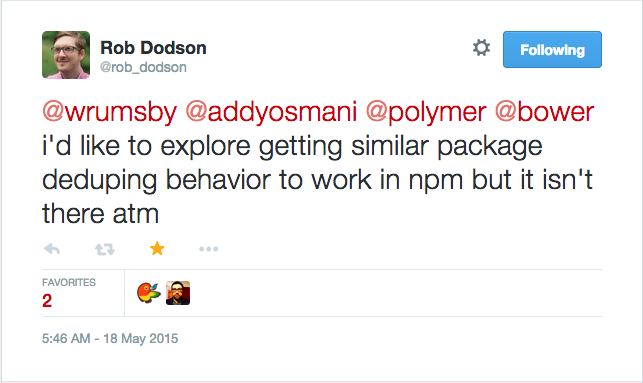
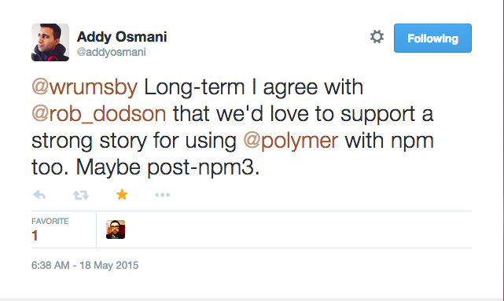

---

## DISCLAIMER

<br/>

1. The problems I want to solve might not be the problems you want to solve.
1. I have tools at my disposal that you might not (e.g. Github Enterprise).
1. I haven't had a chance to look at [jspm](http://jspm.io/).

---



---



---

## That's the point!

---

## Nested vs. Flat



<sub>Image by Max Ogden from [Nested Dependencies](http://maxogden.com/nested-dependencies.html)</sub>

---

## Lots of little modules

In the style of [substack: how I write modules](http://substack.net/how_I_write_modules), _but_ for the browser.

---


---



---



---



---

## The Problem With npm

*According to npm.*

[npm and front-end packaging](http://blog.npmjs.org/post/101775448305/npm-and-front-end-packaging):

1. `node_modules` isn’t arranged the way front-end packages need it to be
1. Front-end dependencies have different conflict-resolution needs

---

## The Other Problem With npm

<br/>

[https://github.com/npm/npm/issues/3328](https://github.com/npm/npm/issues/3328)

<br/>
<br/>

TL;DR: If you want to use version ranges for npm packages
you _need_ to put them in a registry.

---

## Packages

[`bower install`](http://bower.io/docs/api/#install)

---

## .bowerrc

[Configuration](http://bower.io/docs/config/)

---

## Registries

---

## Workflows

---

### bower link

---

### shrinkwrap

[https://github.com/bower/bower/pull/1748](https://github.com/bower/bower/pull/1748)

---

### Bower and CI

`env.CI=true`

---

## The Future

`package.json`

```json
  ...
  "dependencies": {
    ...
  },
  "devDependencies": {
    ...
  },
  "browserDependencies": {
    ...
  },
  ...
```

[npm⇔Angular brainstorming session](https://github.com/npm/npm/wiki/npm%E2%87%94Angular-brainstorming-session)

---


